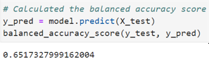
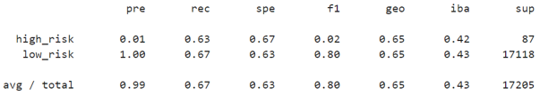
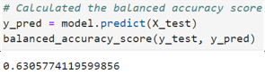
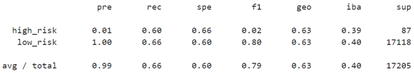
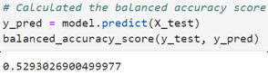
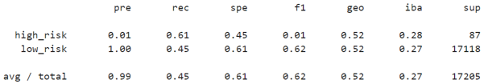
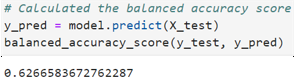
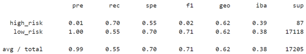
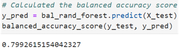
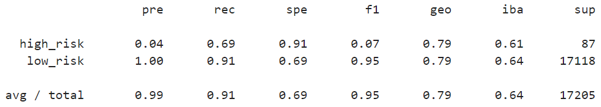

# **Supervised Learning and Credit Risk**

## **Overview of Project**
The following analysis is aimed at applying techniques to deal with class imbalance in binary (and even multi class) classification problems. The first approach is to use resampling techniques such as oversampling and undersampling as well as a combination of the two in conjunction with a logistic regression model from scikit-learn. The second approach is to use ensemble learning models that have resampling techniques built in from the Imbalanced Learn library. The goal is to determine which approaches, if any, yield useful models for predicting credit risk.

The context for the project is assessing credit risk for loan approvals. The dataset is a credit card credit dataset from LendingClub. The dataset is not included in this repository due to size.

The main analysis files are *[credit_risk_resampling.ipynb](/credit_risk_resampling.ipynb)* for resampling techniques combined with the scikit-learn logistic regression classifier and *[credit_risk_ensemble.ipynb](/credit_risk_ensemble.ipynb)* for balanced random forest and easy ensemble AdaBoost classifiers.

### **Results**
The results of the following resampling methods and ensemble models are shown in the sections below. The target variable is loan status which has the two labels of low risk and high risk. Note that the balanced accuracy scores are not straightforward accuracy scores (number of predictions correct over total predictions) and are reported here are the average of recall obtained for each class. Additionally, within the context of credit risk, the worse situation is when an account is misidentified as low risk and is actually high risk thus recall for the high risk class will be most important here.

*Resampling Methods:*
1. Random Oversampling
1. SMOTE Oversampling
1. Cluster Centroids Undersampling
1. SMOTEENN Combination (Over/Under) Sampling

*Ensemble Models:*
1. Balanced Random Forest Model
1. Easy Ensemble AdaBoost Model

#### **Random Oversampling**
The following accuracy and classification report are the result of using the `RandomOverSampler` class with a `LogisticRegression` classifier.

    

* The balanced accuracy is 0.65 for random oversampling which is less than ideal.

    

* The precision for the high risk class is low at 0.01 but it isn't as crucial since this means that there are a lot of accounts identified as high risk that actually are not high risk.
* However, in terms of recall, the high risk category has a 0.63 which should not be acceptable. The recall for low risk is also low at 0.67.

#### **SMOTE Oversampling**
The following accuracy and classification report are the result of using the `SMOTE` class (sampling strategy set to `auto`) with a `LogisticRegression` classifier.

    

* The accuracy for SMOTE oversampling has actually decreased from the random oversampling to 0.63.

    

* The precision remains the same for both classes at 0.01 and 1.00 for high risk and low risk respectively.
* The recall for high risk is 0.60 which is a decrease from random oversampling. The recall for low risk also dropped slightly to 0.66.

#### **Cluster Centroids Undersampling**
The following accuracy and classification report are the result of using the `ClusterCentroids` class with a `LogisticRegression` classifier.

    

*

    

#### **SMOTEENN Combination Sampling**
The following accuracy and classification report are the result of using the `SMOTEENN` class with a `LogisticRegression` classifier.

    

*

    

* precision
* recall

#### **Balanced Random Forest**
The following accuracy and classification report are the result of using the `BalancedRandomForestClassifier` class with number of estimators set to 100.

    

    

#### **Easy Ensemble AdaBoost**
The following accuracy and classification report are the result of using the `BalancedRandomForestClassifier` class with number of estimators set to 100.

    

    

### **Summary**
