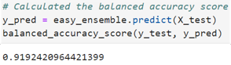
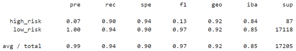

# **Supervised Learning and Credit Risk**

## **Overview of Project**

The main analysis files are *[credit_risk_resampling.ipynb](/credit_risk_resampling.ipynb)* for resampling techniques combined with the ski-kit learn logistic regression classifier and *[credit_risk_ensemble.ipynb](/credit_risk_ensemble.ipynb)* for balanced random forest and easy ensemble adaboost classifiers.

### **Results**

#### **Random Oversampling**

    

    

#### **SMOTE Oversampling**

    

    

#### **Cluster Centroids Undersampling**

    

    

#### **SMOTEENN Combination Sampling**

    

    

#### **Balanced Random Forest**

    

    

#### **Easy Ensemble AdaBoost**

    

    

### **Summary**
